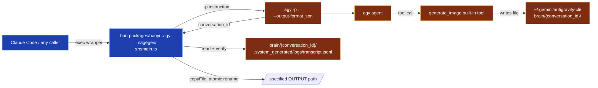

# `agy-imagegen` Backend

Generate images via Antigravity CLI's (`agy`) built-in `generate_image` tool from non-agy runtimes (e.g., Claude Code). The wrapper spawns `agy -p ... --output-format json` and lets the user's existing Antigravity subscription drive image generation — no separate image API key required.

This backend implements the `preferred_image_backend: agy-imagegen` config key referenced in several `SKILL.md` files across this repo.

## Features

| Feature | Status |
|---------|--------|
| **Reliability**: retry + exponential backoff | Default 2 retries |
| **Verification**: confirms `generate_image` was actually invoked (not bypassed) | Checks the run's `transcript.jsonl` for a `GENERATE_IMAGE` step |
| **Verification**: JPEG/PNG magic-byte sanity check | ✓ |
| **Reference images**: up to 3, passed as absolute paths into `ImagePaths` | ✓ — confirmed to preserve character/subject consistency across generations, see below |
| **Idempotency cache**: reuses output for same prompt+aspect+model+refs | `--cache-dir` |
| **Structured logging**: JSONL log file | `--log-file` |
| **Token usage returned** | Embedded in result JSON |
| **Unit tests** | 19 tests (parser / cache / validator) |
| **Error classification**: retryable vs non-retryable | 10 `error_kind` values |

## Why this backend

| Scenario | Conventional backend | This backend |
|----------|---------------------|--------------|
| You have an Antigravity subscription | Per-image API costs add up | Subscription already covers it — zero marginal API cost |
| No image API key available | `baoyu-image-gen` needs an API key | `agy` login is enough |
| Need character/subject consistency across images | Requires a ref-capable provider with careful prompt engineering | `--ref` reference images reliably hold face/hair/outfit across generations (verified, see below) |

## Prerequisites

`agy` (Antigravity CLI) must be installed and authenticated:

```bash
agy --version
agy models        # confirms auth is working
```

`bun` is required for running the wrapper. On macOS:

```bash
brew install oven-sh/bun/bun
```

If `bun` is not on `PATH`, fall back to `npx -y bun packages/baoyu-agy-imagegen/src/main.ts …`.

## Usage

### Direct CLI

```bash
# Inline prompt
bun packages/baoyu-agy-imagegen/src/main.ts \
  --image /tmp/cat.jpg \
  --prompt "A friendly orange cat, watercolor"

# Prompt from file, with a reference image for style/character consistency
bun packages/baoyu-agy-imagegen/src/main.ts \
  --image cover.jpg \
  --prompt-file prompts/01-cover.md \
  --aspect 16:9 \
  --ref character-sheet.jpg

# Verbose mode for debugging
bun packages/baoyu-agy-imagegen/src/main.ts -v --image dog.jpg --prompt "A corgi" --aspect 1:1
```

### Through `baoyu-image-gen`

```bash
${BUN_X} skills/baoyu-image-gen/scripts/main.ts \
  --provider agy-cli \
  --prompt "A friendly orange cat, watercolor" \
  --image /tmp/cat.jpg \
  --ar 1:1 \
  --ref /tmp/character-sheet.jpg
```

The `agy-cli` provider spawns the bundled `agy-imagegen` TS entrypoint internally and surfaces its retry/cache machinery through baoyu-image-gen's standard CLI + batch flow.

On success, stdout emits a single JSON line:

```json
{"status":"ok","path":"/tmp/cat.jpg","bytes":293211,"elapsed_seconds":19}
```

On failure, exit code is non-zero and stdout contains a JSON line with `error` and `error_kind` (see Structured Output below).

### Enabling within image skills

Image-generating skills (e.g., `baoyu-cover-image`, `baoyu-article-illustrator`) already support a `preferred_image_backend` preference. To route them through this backend, set the following in the corresponding `EXTEND.md`:

```yaml
# ~/.baoyu-skills/baoyu-cover-image/EXTEND.md
preferred_image_backend: agy-imagegen
```

When the LLM runs the skill, it reads the preference and — guided by the `### agy-imagegen Backend` section in `CLAUDE.md` — invokes `bun packages/baoyu-agy-imagegen/src/main.ts`.

> **Note**: The integration is mediated by the LLM reading `CLAUDE.md`. It is not a hard binding. If a skill does not route to the backend automatically, mentioning it explicitly in the prompt works.

## Reference images and character consistency

`agy`'s `generate_image` tool accepts up to 3 absolute image paths via its `ImagePaths` argument. This wrapper's `--ref <file>` flag (repeatable, max 3) forwards them.

**Verified behavior**: a base character was generated once (purple bob haircut, round glasses, teal turtleneck, flat-vector style). A second prompt — deliberately omitting any redescription of hair, glasses, or outfit color, only saying "using the exact same character shown in the reference image" — was run with `--ref` pointing at the first image. The second image preserved the face, hairstyle, glasses, and outfit exactly, in a new pose and setting. This makes the backend usable for digital-human / recurring-character workflows (consistent avatar across a batch of scenes, comic panels, slide decks, etc.) without re-describing appearance in every prompt.

Pass reference images the same way as any other ref-capable provider:

```bash
${BUN_X} skills/baoyu-image-gen/scripts/main.ts \
  --provider agy-cli \
  --prompt "Same character, now waving at the camera from a desk" \
  --image scene.jpg \
  --ref character-sheet.jpg
```

## Parameters

| Flag | Required | Description |
|------|----------|-------------|
| `--image <path>` | ✓ | Output image path (JPEG bytes; keep a `.jpg`/`.jpeg` extension; absolute recommended) |
| `--prompt <text>` | one of | Prompt string (mutually exclusive with `--prompt-file`) |
| `--prompt-file <path>` | one of | Read prompt from file (mutually exclusive with `--prompt`) |
| `--aspect <ratio>` | | Aspect ratio: `1:1`, `2:3`, `3:2`, `3:4`, `4:3`, `9:16`, `16:9`. Default `1:1` |
| `--model <name>` | | `agy --model` to run under. Default `gemini-3.7-flash-medium` |
| `--ref <file>` | | Reference image path (repeatable, max 3) |
| `--timeout <ms>` | | `agy` timeout in ms. Default `300000` |
| `--retries <n>` | | Retry count on retryable errors. Default `2` (total attempts = retries + 1) |
| `--retry-delay <ms>` | | Base delay between retries (exponential backoff). Default `1500` |
| `--cache-dir <path>` | | Enable idempotency cache (reuses output for same prompt+aspect+model+refs) |
| `--log-file <path>` | | Structured JSONL log path (appended) |
| `-v` / `--verbose` | | Mirror log entries to stderr |
| `-h` / `--help` | | Show usage |

## Structured Output

On success, stdout contains a single JSON line:

```json
{
  "status": "ok",
  "path": "/tmp/owl.jpg",
  "bytes": 516395,
  "elapsed_seconds": 14,
  "conversation_id": "c88ee5a7-4ba3-4345-b609-1b48bff4edbd",
  "attempts": 1,
  "cached": false,
  "usage": {
    "input": 22167,
    "cached_input": 16290,
    "output": 198,
    "thinking": 126
  }
}
```

Cache hits return with `elapsed_seconds: 0`, `cached: true`, `attempts: 0`.

On failure, exit code is `1` and the JSON contains `error` and `error_kind`:

```json
{
  "status": "error",
  "error": "generate_image was not invoked in <conversation_id>",
  "error_kind": "no_image_gen_tool_use"
}
```

## Error Kinds

| `error_kind` | Retryable | Meaning |
|--------------|-----------|---------|
| `agy_not_installed` | ✗ | `agy` CLI not found |
| `invalid_args` | ✗ | Argument parsing error |
| `prompt_file_missing` | ✗ | `--prompt-file` path does not exist |
| `spawn_failed` | ✓ | `agy` exited non-zero |
| `timeout` | ✓ | Exceeded `--timeout` |
| `no_image_gen_tool_use` | ✓ | Agent did not invoke `generate_image` (it took another path), or the transcript's saved-file path could not be found |
| `output_missing` | ✓ | The file the transcript says was saved is missing on disk |
| `invalid_jpeg` | ✓ | Output is not a valid JPEG or PNG |
| `agent_refused` | ✓ | agy reported a non-`SUCCESS` status, or produced no `conversation_id` |
| `malformed_json` | ✓ | agy's `--output-format json` stdout could not be parsed even after control-character sanitization |

## Measured Performance

| Metric | Value |
|--------|-------|
| First-run latency | 15–35 s |
| Cache-hit latency | < 0.3 s |
| Output dimensions | 1024×1024 at `1:1`; other aspect ratios follow agy's own sizing |
| Output format | **JPEG** (not PNG — see Design Decisions) |
| Token usage per call | ~20k input (~16k cached) + ~200–400 output |
| Quota source | Antigravity subscription |
| Default timeout | 300 s (5 min) |

## Limitations & Risks

1. **Output is JPEG, not PNG.** `agy`'s `generate_image` always writes a `.jpg` file regardless of the requested `ImageName`. The wrapper copies bytes verbatim without transcoding. If a caller explicitly requests a `.png` output path, the file will contain JPEG bytes under a `.png` name — this mirrors an existing seam in `baoyu-image-gen` (`normalizeOutputImagePath` only applies a provider's default extension when the caller omits one) and is not specific to this backend.
2. **ToS gray area.** `agy`'s `generate_image` tool is designed for interactive use. Invoking it programmatically via `agy -p` from an external agent is not explicitly addressed by current Google/Antigravity policies. Suggested guardrails:
   - Personal, low-volume use is reasonable.
   - Not recommended for production automation or high-volume batch jobs.
   - Users are responsible for ensuring their usage complies with applicable terms of service.
3. **`agy`'s JSON output is not always strict JSON.** A raw, unescaped control character (e.g., a bare newline) inside the `response` field has been observed, which both V8's and Python's JSON parsers reject. The wrapper retries with control characters escaped before giving up (`malformed_json` if that still fails).
4. **No concurrency lock.** Unlike `baoyu-codex-imagegen` (whose lock exists because `$CODEX_HOME/generated_images/` is shared across threads), each `agy` run gets its own `brain/<conversation_id>/` directory with no cross-run sharing, so concurrent invocations are safe without a lock.

## Troubleshooting

| Symptom | `error_kind` | Resolution |
|---------|--------------|------------|
| `command not found: agy` | `agy_not_installed` | Install Antigravity CLI and run `agy models` to confirm auth |
| `agy` fails to spawn | `spawn_failed` | Check `agy models` output; inspect the `raw_log` path in verbose mode |
| Timeout | `timeout` | Pass `--timeout 600000` (10 min) for slow networks |
| Agent skipped `generate_image` | `no_image_gen_tool_use` | Auto-retries; consider sharpening the prompt — abstract prompts let the agent wander |
| Output missing | `output_missing` | The transcript said a file was saved but it's gone; check `raw_log` and the `brain/<conversation_id>/` directory |
| Low image quality | — | Sharpen the prompt, try a different aspect, or supply `--ref` |

## Architecture

```
packages/baoyu-agy-imagegen/
├── src/
│   ├── main.ts             # parseArgs → cache → retry loop → emit JSON (`#!/usr/bin/env bun`)
│   ├── types.ts            # CliOptions, GenerateResult, GenError, ErrorKind
│   ├── spawn.ts            # spawn agy -p ... --output-format json; read transcript.jsonl
│   ├── parser.ts           # sanitize + parse stdout JSON; parse transcript.jsonl
│   ├── validator.ts        # verify generate_image invocation + JPEG/PNG magic + atomic copy
│   ├── cache.ts            # cacheKey(sha256), lookup/store
│   ├── logger.ts           # JsonLogger (verbose stderr + JSONL file)
│   ├── parser.test.ts
│   ├── cache.test.ts
│   └── validator.test.ts
├── package.json            # workspace package: `bin` → `src/main.ts`, no build step
└── README.md
```

Run tests:

```bash
cd packages/baoyu-agy-imagegen && bun test
```

## Internal Flow



## Design Decisions

1. **Pure TypeScript entrypoint** — `src/main.ts` carries a `#!/usr/bin/env bun` shebang and is the sole entry, matching the project's `skills/<skill>/scripts/main.ts` convention.
2. **The wrapper copies the file itself — the spawned agent never touches the filesystem.** Unlike `baoyu-codex-imagegen` (where the agent must `cp`/`mv` the rendered image itself, requiring `--sandbox danger-full-access`), this wrapper reads `transcript.jsonl` after the run, extracts the exact saved-file path from the `GENERATE_IMAGE` step's content, and copies it into place with `node:fs/promises`. The agy instruction explicitly forbids `run_command`/shell/file operations. This removes a path-injection surface and lets the wrapper run agy under `--sandbox --dangerously-skip-permissions` (terminal-restricted) rather than a fully permissive mode.
3. **Parse `transcript.jsonl`, not just the top-level JSON response** — the top-level `--output-format json` response is freeform text the model wrote; trusting it alone would let a model that merely *describes* success (without calling the tool) pass verification. The transcript's structured `GENERATE_IMAGE` step is real evidence the tool ran.
4. **No `--continue`/`-c`/`--conversation`, ever** — every run starts a fresh conversation, so its `brain/<conversation_id>/` directory contains only that run's output. This is what makes "a file exists in this directory" trustworthy evidence, with no cross-run ambiguity to guard against.
5. **Shared package, not a skill** — this backend is a CLI utility that skills route to via `preferred_image_backend` and that `baoyu-image-gen --provider agy-cli` spawns internally. It lives under `packages/` alongside `baoyu-codex-imagegen` because it has no `SKILL.md` and is never loaded directly by an agent.
6. **No file lock** — `baoyu-codex-imagegen`'s lock exists to serialize access to a directory shared across Codex threads (`$CODEX_HOME/generated_images/`). `agy`'s per-conversation `brain/` directory has no such sharing, so a lock was dropped rather than inherited.

## Related Files

| File | Role |
|------|------|
| `packages/baoyu-agy-imagegen/src/main.ts` | TypeScript CLI entrypoint (`#!/usr/bin/env bun`) |
| `packages/baoyu-agy-imagegen/src/` | TypeScript implementation |
| `packages/baoyu-agy-imagegen/package.json` | Workspace manifest |
| `skills/baoyu-image-gen/scripts/providers/agy-cli.ts` | Provider adapter that lets `baoyu-image-gen --provider agy-cli` spawn this wrapper |
| `skills/baoyu-image-gen/scripts/agy-imagegen/` | Bundled copy of `packages/baoyu-agy-imagegen/src/` for skill self-containment (kept in sync via `scripts/sync-agy-imagegen.sh`) |
| `docs/agy-imagegen-backend.md` | This document |
| `CLAUDE.md` | Tells LLMs how to invoke this backend |
| `.github/workflows/agy-imagegen-tests.yml` | CI unit tests |
